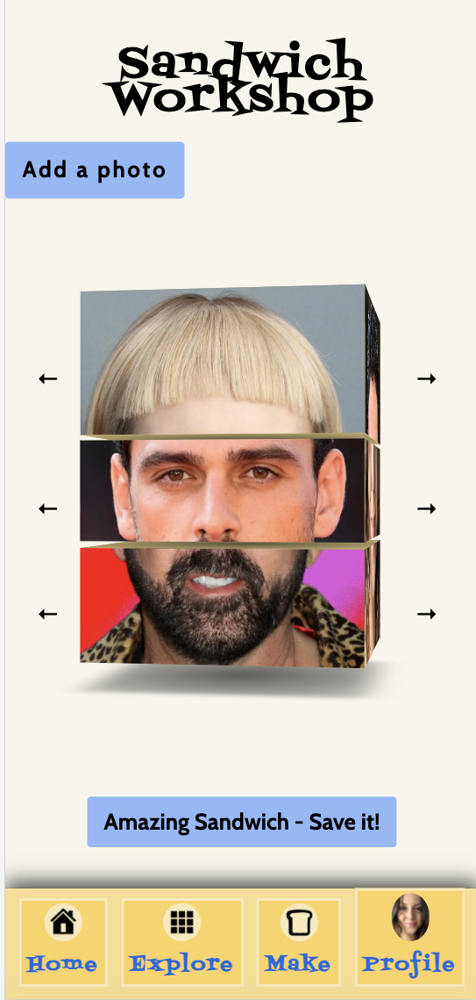

# Open Face Sandwich

> Tired of swiping right on Tinder? Swipe right on your face instead!


### Overview 

```
Have you ever noticed a stranger's nose and thought, "I want that. That's a sexy nose!"
Have you ever seen your forehead in the mirror and thought, "Wow! (dramatic pause) That's big!"
Have you ever looked at your lips and wished they were more plump and luscious?

Well, here's the app for you!

Bring sexy back with Open Face Sandwich!
We're not swiping right on profiles. This isn't Tinder. This is better!
Once you find the perfect face, share it on your profile and be amazed by how many visits you get!

```


A non-user can:

(1) Make a sandwich!<br>
(2) If you like the sandwich, signup, save the sandwich and enjoy the rest of our features!<br>
<br>
A user can: <br>
<br>
(1) Upload photos.<br>
(2) Customize their profiles.<br>
(3) Create a sandwich using either their photos or any photos available in the database.<br>
(4) Display their sandwiches in the gallery.<br>
(5) Edit sandwiches or delete sandwiches.<br>


### Screenshots

<table>
  <tr>
    <td>Uploading and Cropping</td>
     <td>Sandwich Detail Page</td>
     <td>Mobile View</td>
  </tr>
  <tr>
    <td></td>
    <td></td>
    <td></td>
  </tr>
 </table>

### Technologies Used

- HTML 
- CSS
- JS 
- DJANGO
- PYTHON
- POSTGRESQL
- Libraries: Pillow, AWS S3

### Getting Started 

Here is the **<a href="https://open-face-sandwich.herokuapp.com/">link</a>** Bon Appétit

Here is the **<a href="https://trello.com/b/5dwWOlXj/open-face">link</a>**  to the Trello board which includes all the planning that went into creating this beautiful app. 


### WHAT IS COMING NEXT?
- Implement a ‘take a photo’ feature using your webcam or phone’s camera.
- Utilize a toggle switch to exclude photos apart from your own while creating sandwiches.
- Add a "swipe" interface for browsing the sandwich gallery on mobile.
- Hold tight for amazing features coming soon. 

